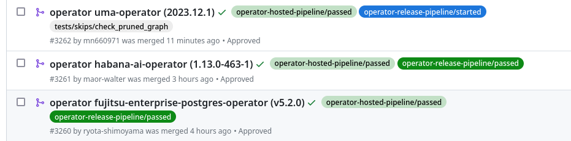
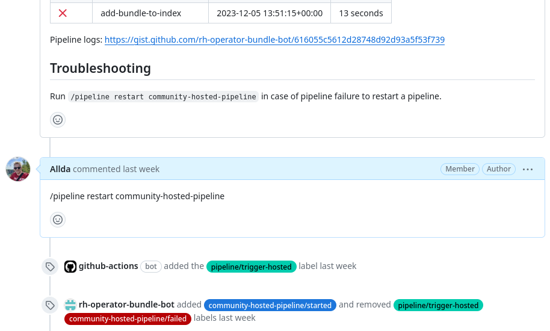
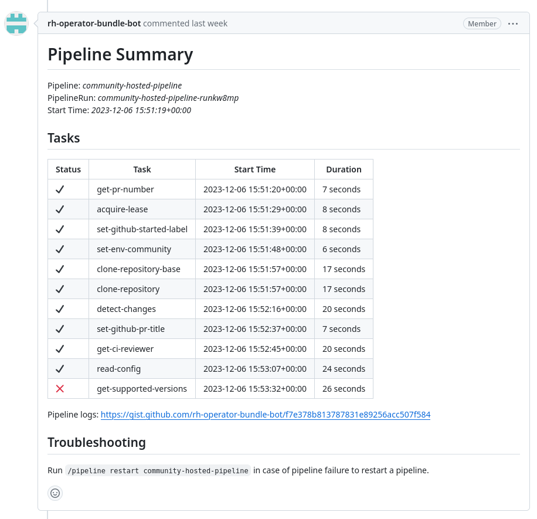

# Operator pipeline admin guide

This document aims to provide information needed for maintenance and troubleshooting of operator pipelines.

## Operator repositories
- Certified operators
    - prod: https://github.com/redhat-openshift-ecosystem/certified-operators
    - nonprod: https://github.com/redhat-openshift-ecosystem/certified-operators-preprod
- Marketplace operators
    - prod: https://github.com/redhat-openshift-ecosystem/redhat-marketplace-operators
    - nonprod: https://github.com/redhat-openshift-ecosystem/redhat-marketplace-operators-preprod
- Community OCP operators
    - prod: https://github.com/redhat-openshift-ecosystem/community-operators-prod
    - nonprod: https://github.com/redhat-openshift-ecosystem/community-operators-pipeline-preprod/

Pre-production repositories are used for all pre-prod environments (stage, dev, qa). Each environment has a dedicated git branch. By selecting a target branch you can select an environment where the operator will be tested.

## OCP environments
- https://console-openshift-console.apps.pipelines-prod.ijdb.p1.openshiftapps.com/pipelines/ns/operator-pipeline-prod
- https://console-openshift-console.apps.pipelines-stage.0ce8.p1.openshiftapps.com/pipelines/ns/operator-pipeline-stage

## Pipelines

Testing and certification of OpenShift operators from ISV and Community sources is handled by OpenShift Pipelines (Tekton)

### ISV pipelines
- **ISV CI pipeline** - The CI pipeline is used by Red Hat Partners to test their operator on their own infrastructure. The main purpose of the pipeline is that the cadence of development cycle can be increased by running the tests locally without a need of submitting the operators to Red Hat. The local infrastructure enables testing operators that have a non trivial HW requirements.
- **ISV Hosted pipeline** - The hosted pipeline provides a testing environment and workflow for ISV operators. The pipeline accepts an operator submitted by ISV in Github repository and executes basic linting, static checks and dynamic tests. The pipeline also communicates with Red Hat internal systems and API in order to control a flow or certification. The pipeline success means the operator bundle meets all certification policies and can be distributed to end users.
- **ISV Release pipeline** - The release pipeline distributes ISV operator to all index images supported by the operator bundle and make sure the new operator is visible on Red Hat Ecosystem catalog.

### Community pipelines
- **Hosted pipeline** - Similarly as the ISV hosted pipeline, the community hosted pipeline verifies if a new operator bundle follows all pre-defined rules and passes all the community tests. The pipeline verifies that operator can be installed on a OCP cluster. A Preflight tools is used to execute a dynamic test suite
- **Release pipeline** - The release pipeline distributes a community operators into OCP catalog.

## Troubleshooting

### Pipeline states
After an operator is submitted to any of the repositories mentioned above a operator pipeline kicks in. The current state of the pipeline is indicated by the PR labels. Right after a pipeline starts a label `operator-hosted-pipeline/started` is added. Based on the result of the pipeline one of the following labels is added and `*/started` label is removed:
- `operator-hosted-pipeline/passed`
- `operator-hosted-pipeline/failed`

If the hosted pipeline finished successfully and PR has been approved the pipeline merges the PR. The merge event is a trigger for the release pipeline. The release pipeline also applies labels based on the current pipeline status.
- `operator-release-pipeline/started`
- `operator-release-pipeline/passed`
- `operator-release-pipeline/failed`

In the best case scenario at the end of a process a PR should have both hosted and release `*/passed` labels.

### Re-trigger mechanism
In case of pipeline failure user or repository owner can re-trigger a pipeline using PR labels. Since the labels can't be set by external contributor a pipeline can be also re-triggered using PR comments. The re-trigger mechanism allows user to re-trigger pipeline only when previous pipeline ended up in failed state.

The pipeline summary provides a description of the failure and a hint of how to re-trigger the pipeline.

The command that re-triggers a pipeline is in a following format:

`/pipeline restart <pipeline name>`

Based on which pipeline fails one of these command can be used to re-trigger it again:

- `/pipeline restart operator-hosted-pipeline`
- `/pipeline restart operator-release-pipeline`

After a pipeline is re-triggered using the command a few labels will be added and removed from the PR. First a new labels `pipeline/trigger-hosted` or `pipeline/trigger-release` is added. This label kick in the pipeline and pipeline itself start adding a labels based on the pipeline status.

### Pipeline logs
Pipelines interacts with user using a Github Pull request interface. There are a slight differences between ISV and community repositories, but overall concept is the same.

At the end of pipeline run a pipeline submits a pipeline summary comment with a basis pipeline metrics and overview of individual tasks.

The community pipeline also directly attaches a link to a Github Gist with a pipeline logs. The ISV pipeline uploads logs and artifacts to Pyxis and logs are available to partner through Red Hat Connect.

### Skip tests
In certain corner cases there is a real need to skip a subset of tests and force a pipeline to pass even though not all checks are green. This is usually initiated by submitting an exception from ISV or community members. In case an exception is reviewed and approved a pipeline has a mechanism to skip selected tests.

To to skip a static or dynamic test a repository administrator needs to apply a PR label in the following format:

`tests/skip/<name of the test>`

So for example if case an operator can't be installed with a default settings and requires a special environment we can skip `DeployableByOLM` by adding `tests/skip/DeployableByOLM` label to a PR.
