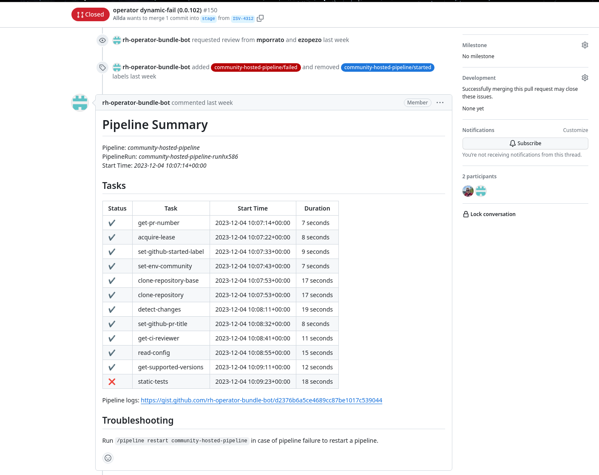

# Submitting your Operator via Pull Requests (PR)

## Overview
To submit an operator one has to do these steps

1. Fork project based on desired [Operator Repository](./pipelines_overview.md#operator-repositories)
2. Place the operator in the target directory. [More info](./contributing-where-to.md)
    - operators
3. Configure `ci.yaml` file. [More info](./operator-ci-yaml.md)
    - Setup reviewers
    - Enable FBC mode
    - Add template to catalog mapping
4. Configure the `release-config.yaml` file if you want to automatically release the operator to the OCP catalogs. [More info](./fbc_autorelease.md#release-configyaml)
5. Make a pull request with a new operator bundle or catalog changes
6. Verify tests and fix problems, if possible
7. Ask for help in the PR in case of problems

## Pull request

When a pull request is created, a number of tests are executed via community hosted pipeline. One can see the results in the comment section of conversation tab.

## You are done
User is done when all tests are green. When the PR is merged, the community release pipeline will be triggered.

## Test results failed?
When operator tests are failing, one can see a following picture

In case of failures, please have a look at the logs of specific tests. If an error is not clear to you, please ask in the PR. Maintainers will be happy to help you with it.

## Useful commands interacting with the pipeline
You can post the following comment/command:

| Command                                       | Functionality                                                                                                                           |
| --------------------------------------------- | --------------------------------------------------------------------------------------------------------------------------------------- |
| `/pipeline restart operator-hosted-pipeline`  | The hosted pipeline will be re-triggered and PR will be merged if possible. The command only works if a previous pipeline failed.       |
| `/pipeline restart operator-release-pipeline` | The release pipeline will be re-triggered. The command only works if a previous pipeline failed.                                        |
| `/test skip {test_case_name}`                 | *test_case_name* test will be skipped. Please consider that only a subset of tests (*currently only pruned graph test*) can be skipped. |
