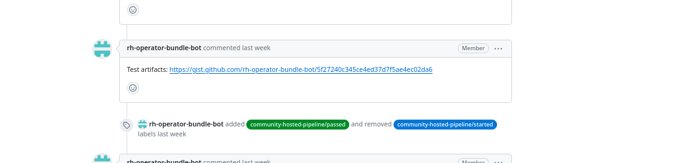
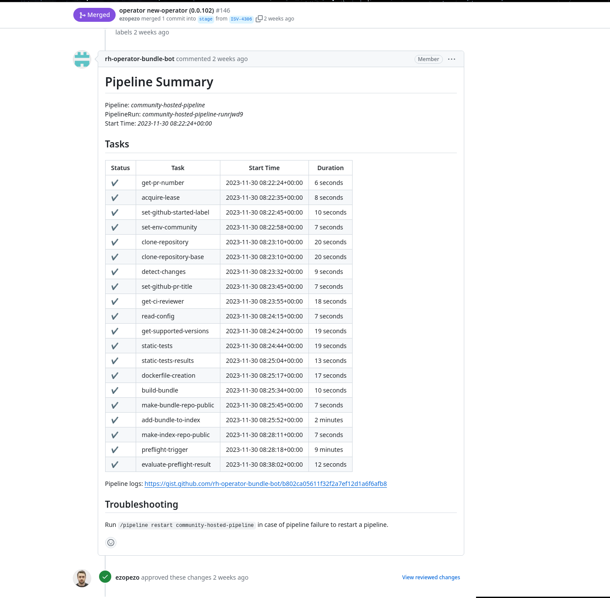

The [preflight](https://github.com/redhat-openshift-ecosystem/openshift-preflight)
tests are designed to test and verify the the operator bundle
content and the format of the operator bundle and if a bundle can be installed
on OCP cluster.

The result link for the logs of the preflight test runs will be posted to the
PR as shown below.

In case of failures, please have a look at the logs of specific tests.
If an error is not clear to you, please ask in the PR.
Maintainers will be happy to help you with it.

Once all of the tests will be passed successfully, the PR will be merged automatically
based on the conditions are met by operator-hosted-pipeline.

The PR will not merge automatically in the following cases:

- If the brand-new operator is submitted.
- If the author of the PR is not listed as a reviewer in the `ci.yaml` file for the
respective operator or as a repository maintainer (community only).
- If the author of the PR is not listed as a reviewer in Red Hat Connect (ISV only)

If there are any of the above cases, the PR needs to be reviewed by the Repositoy maintainers or authorized reviewers. After the approval, the PR needs to be merged manually. Once the PR will be merged, the operator-release-pipeline will be triggered automatically.

>**NOTE:** The operator hosted pipeline run results will be posted in the github PR comment.

