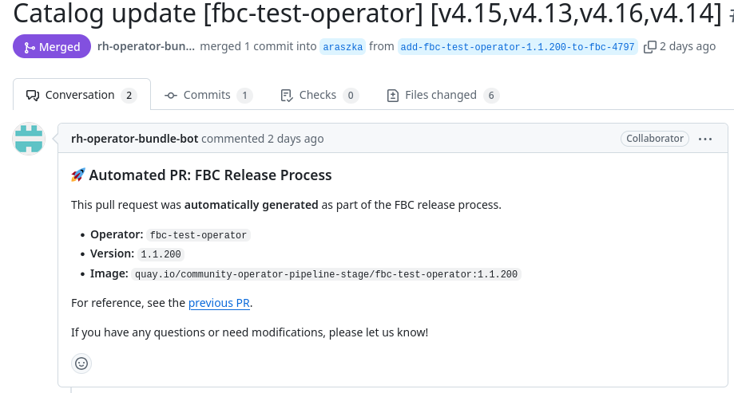

# File-Based Catalog - auto-release
By the nature of the File-Based Catalog (FBC) mode, the release of operator is made of two steps.

* The first step builds, tests and releases bundle image
* The second step adds a bundle to OCP catalog and releases it

The second step can be now automated and user is no longer required to manually create a
second PR with catalog changes. The release pipeline will take care of it.

The process will require an additional configuration in the `release-config.yaml` file.
Once a PR with new bundle and `release-config.yaml` is merged, the release pipeline will
open a new PR with catalog changes.

Example of such PR can be found [here](https://github.com/Allda/community-operators-pipeline-preprod/pull/20).
The second PR is linked with it original PR and looks like [this](https://github.com/Allda/community-operators-pipeline-preprod/pull/25):



## release-config.yaml

If you want your operators to be automatically released to the OCP catalogs in the FBC mode,
you will need to configure the `release-config.yaml` file. The file should be placed
into the bundle version directory, e.g. `operators/aqua/0.0.2/release-config.yaml`.

```
tree operators/aqua
.
├── 0.0.2
│   ├── release-config.yaml # This is the file
│   ├── manifests
│   └── metadata
├── catalog-templates
├── ci.yaml
└── Makefile
```
Its content determines where exactly the bundle will be released in terms of
the OCP version and the place in the update graph.

### Example

```yaml
---
catalog_templates:
  - template_name: basic.yaml
    channels: [my-channel]
    replaces: aqua.0.0.1
  - template_name: semver.yaml
    channels: [Fast, Stable]
```
The example above shows a release configuration where operator bundle is going to be
released to the `my-channel` channel in the `basic.yaml` catalog template and to the
`Fast` and `Stable` channels in the `semver.yaml` catalog template.

The `replaces` field is optional and it specifies the bundle that the new bundle
replaces in the update graph.

### File structure
The schema of the file is available here: [release-config.yaml schema](https://github.com/redhat-openshift-ecosystem/operator-pipelines/blob/main/operator-pipeline-images/operatorcert/schemas/release-config-schema.json).
The schema is validated automatically in the pipeline and the PR will fail with explanations if the file is not valid.

Here is a summary of the file structure:

* The top-level key is `catalog_templates` which is a list of objects.
* Each object has the following keys:
    * `template_name` - the name of the catalog template file in the `catalog-templates` directory.
    * `channels` - a list of channels where the bundle should be released.
        * In case of using `SemVer` a user can pick from allowed values: `Fast`, `Stable` and `Candidate`.
    * `replaces` - the bundle that the new bundle replaces in the update graph. (**Optional**, only for the basic templates)
    * `skips` - a list of bundles that should be skipped in the update graph. (**Optional**, only for the basic templates)
    * `skipRange` - a range of bundles that should be skipped in the update graph. (**Optional**, only for the basic templates)
