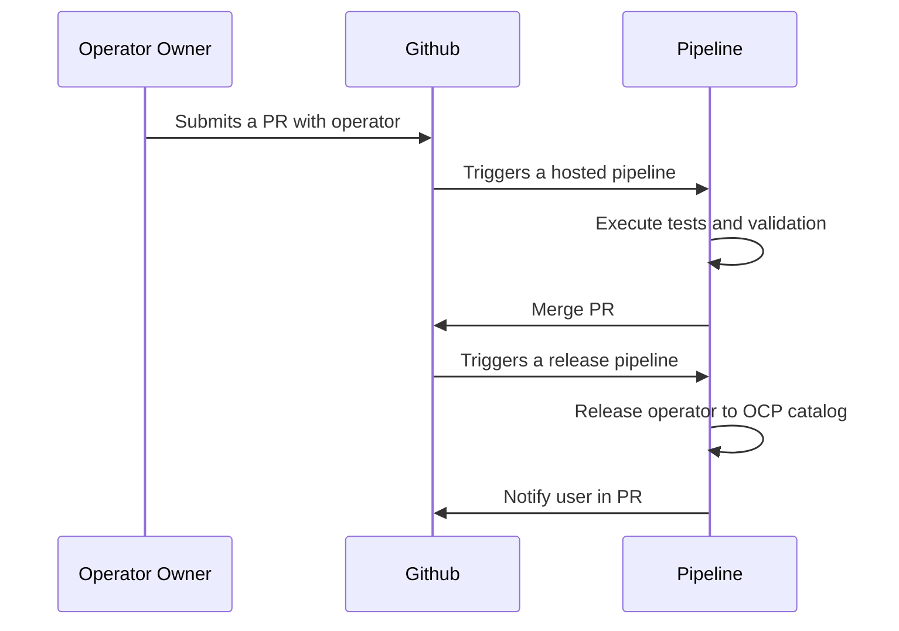

Operator pipelines is a Tekton based solution that serves as a CI/CD platform for
Operators targeting Red Hat Openshift platform. The CI/CD process makes sure all
operators available in the OCP met certain standards.

The series of pipelines validates the operator, tests it and make it available
to all OCP users. In combination with Github repository users or partners are
able to submit a new operator in Pull request workflow and release it.

## Operator repositories

The Openshift platform include by default several catalogs from which users can install
an operator. This CI/CD solution aims for Red Hat Partners or Community members. Thus
there are 3 separate repositories where operator owner can submit operators. Each
repository serves a different purpose and has its own specific rules but is shares
the common CI/CD solution.

- [Certified operators](https://github.com/redhat-openshift-ecosystem/certified-operators)
- [Marketplace operators](https://github.com/redhat-openshift-ecosystem/redhat-marketplace-operators)
- [Community OCP operators](https://github.com/redhat-openshift-ecosystem/community-operators-prod)

## Sequence diagram
