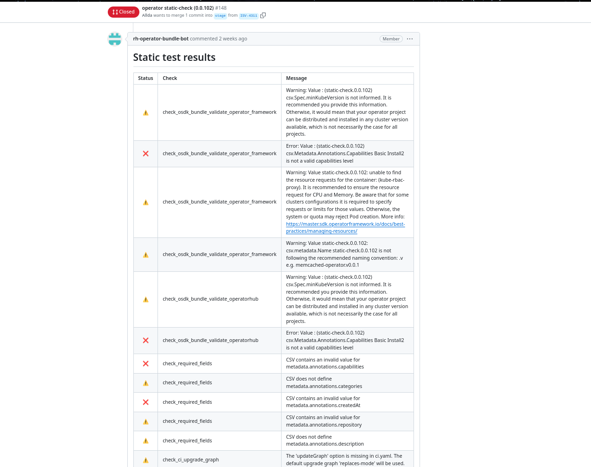
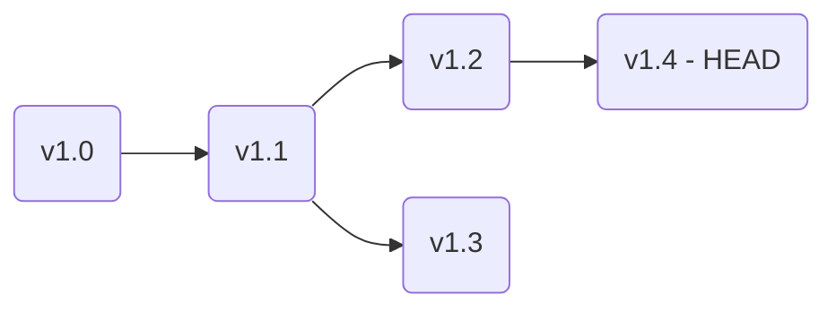
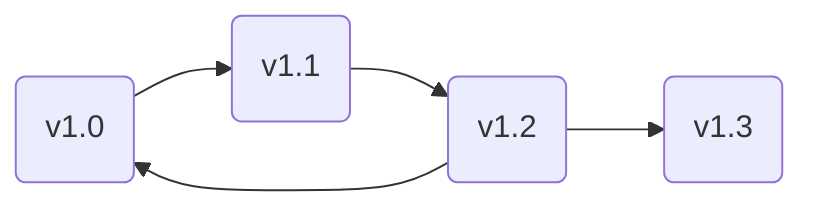

# Static check
The operator pipelines want to make sure the operator that will be released to
OpenShift operator catalog follows a best practices and meet certain standards
that we expect from an operator.

In order to meet these standards a series of static checks have been created for
each stream of operators. The static checks are executed for each operator
submission and reports warning or failures with an description of what is wrong
and suggestion on how to fix it.


Here is the example how the result will look like in the PR:



## ISV tests

#### check_pruned_graph (Warning)
This test make sure the operator update graph is not accidentally pruned by
introducing operator configuration that prunes graph as a unwanted side effect.

The unintentional graph pruning happens when olm.skipRange annotation is set
but replaces field is not set in the CSV. The definition may lead to unintentional
[pruning of the update graph](https://olm.operatorframework.io/docs/concepts/olm-architecture/operator-catalog/creating-an-update-graph/#skiprange).

If this is intentional, you can skip the check
by adding `/test skip check_pruned_graph` comment to a pull request.

#### check_marketplace_annotation
The marketplace operators requires additional metadata in order to be properly
displayed in the Marketplace ecosystem.

There are 2 required fields in the operator `clusterserviceversion` that need
to be filled and need to have specific value:

- `metadata.annotations.marketplace.openshift.io/remote-workflow`
    - Value template: `https://marketplace.redhat.com/en-us/operators/{annotation_package}/pricing?utm_source=openshift_console`
- `metadata.annotations.marketplace.openshift.io/support-workflow`
    - Value template: `https://marketplace.redhat.com/en-us/operators/{annotation_package}/support?utm_source=openshift_console`

Where `{annotation_package}` matches `operators.operatorframework.io.bundle.package.v1`
from `metadata/annotation.yaml` file.

The test is only executed for operators submitted inside the [Red Hat marketplace repo](https://github.com/redhat-openshift-ecosystem/redhat-marketplace-operators).

## Community tests

#### check_osdk_bundle_validate_operatorhub
The test is based on `operator-sdk bundle validate` command with `name=operatorhub` test suite [(link)](https://sdk.operatorframework.io/docs/cli/operator-sdk_bundle_validate/#operator-sdk-bundle-validate).

#### check_osdk_bundle_validate_operator_framework
The test is based on `operator-sdk bundle validate` command with `suite=operatorframework` test suite [(link)](https://sdk.operatorframework.io/docs/cli/operator-sdk_bundle_validate/#operator-sdk-bundle-validate).

#### check_required_fields
| Field name           | Validation | Description                                                                                                                                                      |
| -------------------- | ---------- | ---------------------------------------------------------------------------------------------------------------------------------------------------------------- |
| `spec.displayName`   | `.{3,50}`  | A string with 3 - 50 characters                                                                                                                                  |
| `spec.description`   | `.{20,}`   | A bundle description with at least 20 characters                                                                                                                 |
| `spec.icon`          | `media`    | A valid base64 content with a supported media type (`{"base64data": <b64 content>, "mediatype": enum["image/png", "image/jpeg", "image/gif", "image/svg+xml"]}`) |
| `spec.version`       | `SemVer`   | Valid semantic version                                                                                                                                           |
| `spec.maintainers`   |            | At least 1 maintainer contacts. Example: `{"name": "User 123", "email": "user@redhat.com"}`                                                                      |
| `spec.provider.name` | `.{3,}`    | A string with at least 3 characters                                                                                                                              |
| `spec.links`         |            | At least 1 link. Example: `{"name": "Documentation", "url": "https://redhat.com"}`                                                                               |

#### check_dangling_bundles
The test prevents from releasing an operator and keeping any previous bundle dangling.
A dangling bundle is a bundle that is not referenced by any other bundle and is
not a HEAD of a channel.

In the example bellow the `v1.3` bundle is dangling.

#### check_api_version_constraints
The test verifies a consistency between value `com.redhat.openshift.versions` from
annotation with `spec.minKubeVersion`. In case a an operator targets specific version
of OpenShift and at the same time sets minimal kube version that is higher than
the one supported by the OCP. The test raises an error.

Example:

Following combination is not valid since the OCP 4.9 is based on 1.22 Kubernetes.

```
spec.minKubeVersion: 1.23

com.redhat.openshift.versions: 4.9-4.15
```
#### check_upgrade_graph_loop

The purpose of this test is to check whether there are any loops in the upgrade graph.

As stated on the graph below the edge between `v1.2` and `v1.0` introduces
a loop in the graph.

#### check_replaces_availability
The test aims to verify if a bundle referenced by the `replaces` value is available in all
catalog version where the given bundle is going to be released to. The list of
catalog version is determined by the `com.redhat.openshift.versions` annotation if present.
If the annotation is not present the bundle targets all supported ocp version.

To fix the issue either change a range of versions where a bundle is going to be
released by updating the annotation or change the `replaces` value.
#### check_operator_name_unique
The test makes sure the operator is consistent when using operator names as defined
in the `clusterserviceversion`. It is not allowed to have multiple bundle names for
a single operator. The source of the value is at `csv.metadata.name`.
#### check_ci_upgrade_graph
The test verifies a content of the `ci.yaml` file and make sure only allowed values are
used for `updateGraph` key. The currently supported values are: `["replaces-mode", "semver-mode"]`.

## Common tests

#### check_operator_name (Warning)
The test verifies a consistency between operator name annotation and operator
name in the CSV definition. The source of these values are:

 - `operators.operatorframework.io.bundle.package.v1` (`metadata/annotation.yaml`)
 - `csv.metadata.name` - the name without a version (`manifests/.*.clusterserviceversion.yaml`)

#### check_bundle_images_in_fbc
This check will ensure that all bundle images in the file based catalog for given
operator catalog(s) use allowed image registry. Allowed registries are configured
in `(repo_root)/config.yaml` under the key `allowed_bundle_registries`.

#### check_schema_bundle_release_config
The test validates the `release-config.yaml` file against the schema. The file description
including the schema definition can be found [here](./fbc_autorelease.md#release-configyaml).

#### check_schema_operator_ci_config
The test validates the `ci.yaml` file against the schema. The schema definition can
be found[here](https://github.com/redhat-openshift-ecosystem/operator-pipelines/blob/main/operator-pipeline-images/operatorcert/schemas/ci-schema.json).

#### check_catalog_usage_ci_config
The test makes sure the `fbc.catalog_mapping` in `ci.yaml` file is not mapping a single
catalog to multiple catalog templates. The test will fail if the same catalog is used
in multiple templates.

Example of the `ci.yaml` file where `v4.14` catalog is used in two different templates.
```yaml
---
fbc:
  enabled: true

  catalog_mapping:
    - template_name: basic.yaml
      catalog_names: ["v4.14", "v4.15", "v4.16"]
      type: olm.template.basic
    - template_name: semver.yaml
      catalog_names: ["v4.13", "v4.14"] # The 4.14 is already used in the basic.yaml template
      type: olm.semver
```
## Running tests locally

```bash
# Install the package with static checks
$ pip install git+https://github.com/redhat-openshift-ecosystem/operator-pipelines.git

# Execute a test suite
# In this example tests are executed for aqua operator
# with 2022.4.15 version and two operator catalogs (v4.17/aqua and v4.18/aqua)
$ python static-tests \
    --repo-path ~/community-operators-prod \
    --suites operatorcert.static_tests.community \
    --output-file /tmp/operator-test.json \
    --verbose \
    aqua 2022.4.15 v4.17/aqua,v4.18/aqua

```
```javascript
$ cat /tmp/operator-test.json | jq

{
  "passed": false,
  "outputs": [
    {
      "type": "error",
      "message": "Channel 2022.4.0 has dangling bundles: {Bundle(aqua/2022.4.14)}",
      "test_suite": "operatorcert.static_tests.community",
      "check": "check_dangling_bundles"
    },
    {
      "type": "warning",
      "message": "Warning: Value aquasecurity.github.io/v1alpha1, Kind=ClusterConfigAuditReport: provided API should have an example annotation",
      "test_suite": "operatorcert.static_tests.community",
      "check": "check_osdk_bundle_validate_operator_framework"
    },
    {
      "type": "warning",
      "message": "Warning: Value aquasecurity.github.io/v1alpha1, Kind=AquaStarboard: provided API should have an example annotation",
      "test_suite": "operatorcert.static_tests.community",
      "check": "check_osdk_bundle_validate_operator_framework"
    },
    {
      "type": "warning",
      "message": "Warning: Value aquasecurity.github.io/v1alpha1, Kind=ConfigAuditReport: provided API should have an example annotation",
      "test_suite": "operatorcert.static_tests.community",
      "check": "check_osdk_bundle_validate_operator_framework"
    },
    {
      "type": "warning",
      "message": "Warning: Value : (aqua-operator.v2022.4.15) csv.Spec.minKubeVersion is not informed. It is recommended you provide this information. Otherwise, it would mean that your operator project can be distributed and installed in any cluster version available, which is not necessarily the case for all projects.",
      "test_suite": "operatorcert.static_tests.community",
      "check": "check_osdk_bundle_validate_operator_framework"
    },
    {
      "type": "warning",
      "message": "Warning: Value : (aqua-operator.v2022.4.15) csv.Spec.minKubeVersion is not informed. It is recommended you provide this information. Otherwise, it would mean that your operator project can be distributed and installed in any cluster version available, which is not necessarily the case for all projects.",
      "test_suite": "operatorcert.static_tests.community",
      "check": "check_osdk_bundle_validate_operator_framework"
    },
    {
      "type": "warning",
      "message": "Warning: Value aqua-operator.v2022.4.15: this bundle is using APIs which were deprecated and removed in v1.25. More info: https://kubernetes.io/docs/reference/using-api/deprecation-guide/#v1-25. Migrate the API(s) for podsecuritypolicies: ([\"ClusterServiceVersion.Spec.InstallStrategy.StrategySpec.ClusterPermissions[2].Rules[7]\"])",
      "test_suite": "operatorcert.static_tests.community",
      "check": "check_osdk_bundle_validate_operator_framework"
    },
    {
      "type": "warning",
      "message": "Warning: Value aqua-operator.v2022.4.15: this bundle is using APIs which were deprecated and removed in v1.25. More info: https://kubernetes.io/docs/reference/using-api/deprecation-guide/#v1-25. Migrate the API(s) for podsecuritypolicies: ([\"ClusterServiceVersion.Spec.InstallStrategy.StrategySpec.ClusterPermissions[2].Rules[7]\"])",
      "test_suite": "operatorcert.static_tests.community",
      "check": "check_osdk_bundle_validate_operator_framework"
    },
    {
      "type": "warning",
      "message": "Warning: Value aqua-operator.v2022.4.15: unable to find the resource requests for the container: (aqua-operator). It is recommended to ensure the resource request for CPU and Memory. Be aware that for some clusters configurations it is required to specify requests or limits for those values. Otherwise, the system or quota may reject Pod creation. More info: https://master.sdk.operatorframework.io/docs/best-practices/managing-resources/",
      "test_suite": "operatorcert.static_tests.community",
      "check": "check_osdk_bundle_validate_operator_framework"
    },
    {
      "type": "warning",
      "message": "Warning: Value aquasecurity.github.io/v1alpha1, Kind=ConfigAuditReport: provided API should have an example annotation",
      "test_suite": "operatorcert.static_tests.community",
      "check": "check_osdk_bundle_validate_operatorhub"
    },
    {
      "type": "warning",
      "message": "Warning: Value : (aqua-operator.v2022.4.15) csv.Spec.minKubeVersion is not informed. It is recommended you provide this information. Otherwise, it would mean that your operator project can be distributed and installed in any cluster version available, which is not necessarily the case for all projects.",
      "test_suite": "operatorcert.static_tests.community",
      "check": "check_osdk_bundle_validate_operatorhub"
    },
    {
      "type": "warning",
      "message": "Warning: Value : (aqua-operator.v2022.4.15) csv.Spec.minKubeVersion is not informed. It is recommended you provide this information. Otherwise, it would mean that your operator project can be distributed and installed in any cluster version available, which is not necessarily the case for all projects.",
      "test_suite": "operatorcert.static_tests.community",
      "check": "check_osdk_bundle_validate_operatorhub"
    },
    {
      "type": "warning",
      "message": "Warning: Value aqua-operator.v2022.4.15: this bundle is using APIs which were deprecated and removed in v1.25. More info: https://kubernetes.io/docs/reference/using-api/deprecation-guide/#v1-25. Migrate the API(s) for podsecuritypolicies: ([\"ClusterServiceVersion.Spec.InstallStrategy.StrategySpec.ClusterPermissions[2].Rules[7]\"])",
      "test_suite": "operatorcert.static_tests.community",
      "check": "check_osdk_bundle_validate_operatorhub"
    },
    {
      "type": "warning",
      "message": "Warning: Value : The \"operatorhub\" validator is deprecated; for equivalent validation use \"operatorhub/v2\", \"standardcapabilities\" and \"standardcategories\" validators",
      "test_suite": "operatorcert.static_tests.community",
      "check": "check_osdk_bundle_validate_operatorhub"
    },
    {
      "type": "error",
      "message": "Invalid bundle image(s) found in OperatorCatalog(v4.17/aqua):
      quay.io/invalid-repository/aqua@sha256:123. Only these registries are allowed for bundle images: quay.io/allowed-repository/, registry.connect.redhat.com/.",
      "test_suite": "operatorcert.static_tests.common",
      "check": "check_bundle_images_in_fbc"
    }
  ]
}

```
